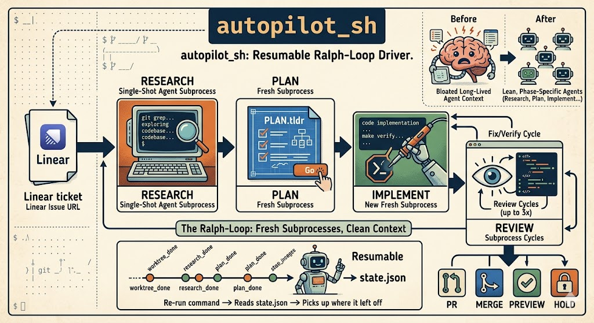

# autopilot_sh



Resumable, agent-agnostic ralph-loop driver: takes a Linear ticket from worktree creation through merge as a sequence of single-shot agent subprocesses.

## Why

A single long-lived agent context bloats and degrades. Splitting into phases — research / plan / implement / review — with fresh subprocesses keeps each phase lean and lets you resume after any crash.

## Install

```bash
git clone <this-repo>
cd autopilot_sh
./install.sh   # symlinks bin/autopilot into ~/.local/bin
```

You need: bash 3.2+ (macOS default works), `jq`, `envsubst` (from `gettext`), `git` with worktree support, and a coding-agent CLI on PATH (default: Claude Code's `claude`). The agent must have a **Linear MCP server** installed and authenticated — ticket fetch goes through MCP, not direct API. For Claude Code, enable the `plugin:linear:linear` MCP (or equivalent).

### Auto-cd into the worktree (optional)

A child process can't change the parent shell's directory, so autopilot can't `cd` you into the worktree directly. Add this shell function to your `~/.zshrc` or `~/.bashrc` to wrap the call and `cd` after success:

```bash
autopilot() {
  command autopilot "$@"
  local rc=$?
  local marker="${XDG_STATE_HOME:-$HOME/.local/state}/autopilot/last-wt"
  if [[ $rc -eq 0 && -f "$marker" ]]; then
    cd "$(cat "$marker")" || return
  fi
  return $rc
}
```

Now `autopilot <linear-url>` leaves you inside the worktree when it finishes. The marker file (`$XDG_STATE_HOME/autopilot/last-wt`, default `~/.local/state/autopilot/last-wt`) is written as soon as the ticket ID is parsed, so even after a mid-run Ctrl-C you can `cd "$(cat ~/.local/state/autopilot/last-wt)"` to jump into the worktree to inspect logs / state.

## Usage

```bash
cd /path/to/your/repo
cp /path/to/autopilot_sh/.autopilotrc.example .autopilotrc
# edit .autopilotrc — set symlinks, setup, verify commands

# Default: interactive — pauses at plan TLDR and post-review checkpoint.
autopilot https://linear.app/<team>/issue/TEAM-123/some-slug

# Full autopilot: no human in the loop.
autopilot --full https://linear.app/<team>/issue/TEAM-123/some-slug

# Plan-file mode: run an existing plan, no Linear ticket.
autopilot docs/plans/2026-06-04-shared-app-sidebar.md
```

Re-run the same command to resume from the last completed phase. See [Resuming after interruption](#resuming-after-interruption) below for details.

### Plan-file mode

Pass a plan file (an argument ending in `.md`, or any existing file) instead of a
Linear URL to run a plan you already wrote — useful when you've planned by hand, or
in a repo without Linear. Autopilot skips the Linear fetch, research, and plan
phases: it creates a worktree (`<base>/<project>/<slug>`, branch `feature/<slug>`,
slug derived from the filename minus any leading `YYYY-MM-DD-`), copies the plan to
`.autopilot/plan.md`, and resumes at the implement phase. The plan is treated as
pre-approved, so the plan checkpoint is skipped; the post-review checkpoint still
applies. Everything downstream — implement, the reviewer/adversary/codex cycle, and
merge/PR — runs exactly as in ticket mode.

## Modes

| Mode | Plan checkpoint | Review checkpoint |
| --- | --- | --- |
| `interactive` (default) | Shows TLDR. Type `go` to proceed, `changes <feedback>` to re-run the planner with your additions (loops until `go`), or `stop` to halt. | Shows summary. Type `merge` / `pr` / `preview` / `hold`. |
| `full` | Auto-approved. | Takes `AUTOPILOT_DEFAULT_ACTION` (default `pr`). |

Set via `--full` / `--interactive` CLI flag (overrides `AUTOPILOT_MODE` env).

## Configuration

See `.autopilotrc.example`. Per-project config lives in `.autopilotrc` in each repo you want to drive.

| Var | Default | Purpose |
| --- | --- | --- |
| `AUTOPILOT_MODE` | `interactive` | `interactive` or `full` |
| `AUTOPILOT_DEFAULT_ACTION` | `pr` | In `full` mode: what to do after review (`merge`/`pr`/`preview`/`hold`) |
| `AUTOPILOT_WORKTREE_BASE` | `$HOME/wt` | Where worktrees live |
| `AUTOPILOT_AGENT_CMD` | `claude -p --output-format=stream-json --model $AUTOPILOT_MODEL` | Coding-agent CLI. Reads prompt on stdin. |
| `AUTOPILOT_CODEX_CMD` | `codex exec --json --full-auto` | Cross-review agent run each cycle between adversary and fixer. `--json` is rendered by `codex_pretty`. Skipped if binary absent; empty to disable. |
| `AUTOPILOT_MODEL` | `claude-opus-4-8` | Model passed to the agent |
| `AUTOPILOT_VERIFY_CMD` | `make check test` | Run at end of implement + after each fixer cycle |
| `AUTOPILOT_SETUP_CMD` | (none) | Run inside fresh worktree (e.g. `pnpm install`) |
| `AUTOPILOT_SYMLINKS` | (none) | Newline list of paths to symlink from source repo (`.env`, `.mcp.json`) |

## Using with non-Claude agents

Set `AUTOPILOT_AGENT_CMD` to any CLI that reads a prompt on stdin and exits non-zero on failure. Examples:

```bash
# Codex CLI
export AUTOPILOT_AGENT_CMD="codex -p"

# Aider
export AUTOPILOT_AGENT_CMD="aider --message-file /dev/stdin"
```

Whichever agent you choose, it must have a Linear MCP server installed and authenticated. The Linear-fetch prompt explicitly refuses to fall back to direct HTTP — single auth path, intentional.

## Phase order

```
worktree → research → plan → [checkpoint] → implement → review×3 → [checkpoint] → merge|pr|preview|hold
```

Each `review` cycle runs reviewer → adversary → **codex cross-review** (if `codex` is on PATH) → fixer.

[Plan-file mode](#plan-file-mode) enters the pipeline at `implement`, skipping `worktree`'s Linear fetch plus the `research`, `plan`, and plan-`[checkpoint]` steps.

Each phase writes a marker to `<worktree>/.autopilot/state.json`. Re-running the entry script skips completed phases.

## Resuming after interruption

Re-run the exact same command and autopilot continues from the last completed phase:

```bash
cd /path/to/your/repo
autopilot https://linear.app/<team>/issue/TEAM-123/some-slug
```

State lives in `<worktree>/.autopilot/state.json` — that file is the resume protocol. The script reads `.phase` and skips every phase already done.

### Where it picks up

| Interruption point | Behavior on re-run |
| --- | --- |
| Between phases (script exited cleanly) | Continues at the next phase. |
| Mid-phase (Ctrl-C while the agent was running) | That phase never marked done → re-runs from scratch. Prompts are written to be idempotent (`02-research` clobbers `research.md`; `04-implement` reads plan checkboxes and skips done tasks; etc). |
| At a checkpoint waiting for input | You're re-prompted. No work lost. |
| Phase failed non-zero (e.g. `make check test` failed at end of implement) | Phase didn't mark done — re-run picks up there. Fix the underlying issue first if needed. The failed phase's log is at `<worktree>/.autopilot/logs/<phase>.log`. |

### Inspecting current state

```bash
WT=~/wt/<project>/<ticket>
jq -r '"phase=\(.phase)  cost=$\(.total_cost_usd // 0)"' "$WT/.autopilot/state.json"
ls "$WT/.autopilot/logs/"
```

### Forcing a phase to re-run

If you want to redo a specific phase (e.g. regenerate the plan with a fresh context), back the phase pointer up to *before* the marker you want re-run:

```bash
WT=~/wt/<project>/<ticket>
# To regenerate the plan: rewind to research_done
jq '.phase = "research_done"' "$WT/.autopilot/state.json" \
  > "$WT/.autopilot/state.json.tmp" && mv "$WT/.autopilot/state.json"{.tmp,}
autopilot <linear-url>
```

Valid phase markers (in order): `none`, `worktree_done`, `research_done`, `plan_done`, `plan_approved`, `implement_done`, `review_cycle_1_done`, `review_cycle_2_done`, `review_cycle_3_done`, `review_approved`, `merged`.

### Starting completely fresh

```bash
WT=~/wt/<project>/<ticket>
BRANCH=$(jq -r .branch "$WT/.autopilot/state.json")
rm -rf "$WT"
git -C /path/to/source/repo worktree prune
git -C /path/to/source/repo branch -D "$BRANCH"
autopilot <linear-url>
```

### Running multiple tickets

State is per-worktree, so different tickets resume independently. `autopilot URL-A` and `autopilot URL-B` write to different `.autopilot/state.json` files under different worktree directories — you can have one ticket paused at a checkpoint and start another in a fresh terminal without conflict.

## Layout

```
bin/autopilot       Entry script
lib/                Sourced bash modules
prompts/            Per-phase prompt templates ({{VAR}} substitution)
templates/          Initial state.json, feedback.json, plan template
tests/              bats-core unit tests
```

## Development

```bash
make test    # bats tests
make lint    # shellcheck
```

## Potential improvements

The pipeline (state machine, phases, checkpoints, review cycle) is agent-agnostic, but a few pieces still assume Claude Code. Cleanup ideas for anyone who wants to send a PR:

### Agent-agnostic mode

Add `AUTOPILOT_AGENT=claude|codex|aider` that picks the right defaults so users don't hand-craft every flag.

The agent-profile seam (`lib/agent.sh::agent_cmd_for` / `agent_filter_for`) already
dispatches command + output filter by profile name (`primary`, `cross`). Extending it to
a full `AUTOPILOT_AGENT=claude|codex|aider` selector for the *primary* agent is the
natural next step.

- **Pretty filter** (`lib/agent.sh::agent_pretty`) — currently parses Claude's `stream-json` schema (`{"type":"assistant","message":{"content":[...]}}`). Non-JSON lines already pass through verbatim, so dropping `--output-format=stream-json` from `AUTOPILOT_AGENT_CMD` gives you the agent's native streaming UI for free. A proper fix is per-agent filters dispatched by the new env var.
- **Permission flag** — `--permission-mode bypassPermissions` is Claude-Code syntax. Codex uses `--full-auto`; aider auto-approves by default.

### Prompt portability

`prompts/02-research.md` references Claude Code's `codebase-*` subagents by name. Other agents don't have those. Either:
- Make subagent invocation conditional on agent type, or
- Rewrite the research prompt to be agent-neutral (just "explore the codebase via Read/Grep/Glob and produce research.md").

### Linear fetch without MCP

`lib/linear.sh::linear_fetch` shells out to the agent to call `mcp__plugin_linear_linear__get_issue`. Aider doesn't support MCP. A pure-curl fallback against the Linear GraphQL API (gated on `LINEAR_API_KEY`) would unlock aider and remove the agent dependency for the cheapest phase.

### Worktree placement convention

Default worktree base is `$HOME/wt/<project>/<ticket>/`. Repos with their own worktree tooling (e.g., trayoai's `scripts/worktree-new` puts them in `.worktrees/` with port-offset Docker stacks) won't get that integration. A hook (`AUTOPILOT_WORKTREE_CMD=./scripts/worktree-new`) would let autopilot delegate creation to the repo's own script.

### Per-phase model overrides

`AUTOPILOT_MODEL` applies uniformly. The design doc reserved `AUTOPILOT_MODEL_REVIEWER`, `AUTOPILOT_MODEL_ADVERSARY`, etc., for cost optimization (e.g., Haiku for reviewer/adversary, Opus only for plan/implement). Not wired yet.

### Testing gaps

`make test` covers config/linear/phases/state/agent_pretty. Not covered: `phase01.sh` (worktree creation), `phase06.sh` (merge/pr/preview/hold), `review.sh` (cycle driver), `checkpoint.sh` (interactive `read` loop). These need fixture-based or pty-driven tests.

### UX

- Setup command output (`pnpm install`, `prisma generate`) is unfiltered raw stdout — fine but loud. Could be silenced behind a "show on failure" toggle.
- No way to skip phases ad-hoc (e.g., "I already have a plan, jump to implement"). A `--from <phase>` flag would help.
- No dry-run of what each phase will do before kicking it off.

## License

MIT
